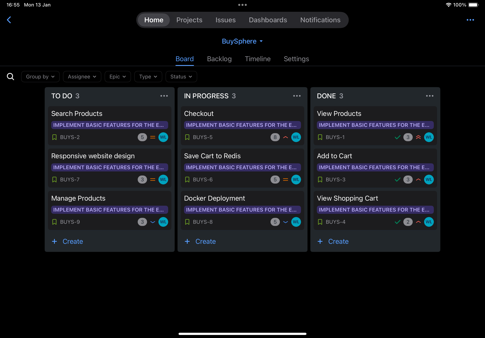
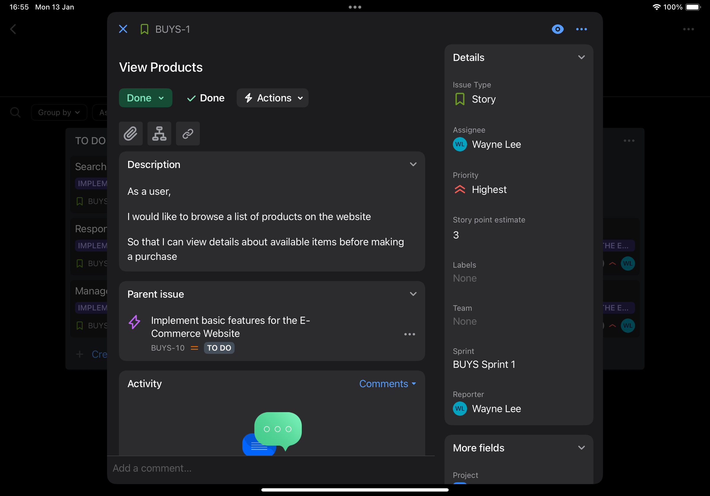

# BuySphere


## Overview
This project is a web application designed as a Minimum Viable Product (MVP) to showcase the integration of modern web technologies. The main goals of this project are to demonstrate proficiency in **Next.js (TypeScript)**, **ASP.NET Core C#**, **Docker**, **Redis**, and to utilize **Jira** for sprint-based agile development.

---

## Technologies Used

### 1. **Frontend: Next.js (TypeScript)**
- **Framework**: Next.js
- **Language**: TypeScript
- **Features**:
  - Server-Side Rendering (SSR)
  - Static Site Generation (SSG)
  - API integration with the backend via RESTful endpoints
  - Modular and reusable components

### 2. **Backend: ASP.NET Core (C#)**
- **Framework**: ASP.NET Core
- **Language**: C#
- **Features**:
  - RESTful API for managing application data
  - Integration with Redis for caching and session management
  - Scalability using Docker containers
  - Secure endpoints and robust error handling

### 3. **Containerization: Docker**
- **Purpose**:
  - Simplify the development and deployment process.
  - Create isolated environments for the frontend, backend, and Redis.

### 4. **Caching & Storage: Redis**
- **Use Case**:
  - Store session data, cache API responses, and manage real-time data requirements.

---
### 5.  **Jira Notes for BuySphere Project**

## Overview
The BuySphere project utilizes Jira to manage development tasks efficiently. The key components of the project board include tasks, their statuses, and priorities.

---

## Sprint Board Overview
### Image:


### Description:
The Jira Sprint Board is divided into three main columns:
1. **To Do**:
   - Represents tasks that are planned but have not yet been started.
   - Examples: "Search Products", "Responsive Website Design", and "Manage Products".
   
2. **In Progress**:
   - Shows tasks that are currently being developed or tested.
   - Examples: "Checkout", "Save Cart to Redis", and "Docker Deployment".

3. **Done**:
   - Lists tasks that have been completed and are ready for review or release.
   - Examples: "View Products", "Add to Cart", and "View Shopping Cart".

Each task includes details such as:
- **Assignee**: The person responsible for the task.
- **Story Points**: The estimated effort required to complete the task.
- **Priority**: Indicates the importance of the task (e.g., Highest).

---

## Task Detail Example
### Image:


### Description:
This is an example of a task detail view in Jira:

- **Task Name**: View Products
- **Description**:
  - As a user, I would like to browse a list of products on the website.
  - So I can view details about available items before purchasing.
- **Priority**: Highest
- **Story Points**: 3
- **Status**: Done
- **Parent Issue**: Implement basic features for the E-Commerce Website
- **Sprint**: BuySphere Sprint 1
- **Assignee**: Wayne Lee

This detailed view provides all the necessary information for task tracking and status updates.

---

## Conclusion
Jira is an essential tool for managing tasks in the BuySphere project. It helps organize, prioritize, and monitor the progress of tasks across different stages of the sprint. This structured approach ensures a smooth workflow and successful project delivery.

## Other tools Examples

### 1. Server-Side Rendering (SSR) (plan to add)
This example demonstrates fetching product data dynamically on the server for every request.

```javascript
// pages/product/[id].tsx
import React from 'react';

export async function getServerSideProps(context) {
    const { id } = context.params;
    const res = await fetch(`https://api.example.com/products/${id}`);
    const product = await res.json();
    return { props: { product } };
}

const ProductPage = ({ product }) => (
    <div>
        <h1>{product.name}</h1>
        <p>{product.description}</p>
        <p>Price: ${product.price}</p>
    </div>
);

export default ProductPage;
```

---

### 2. Static Site Generation (SSG) (plan to add)
This example demonstrates pre-rendering product data at build time with incremental updates.

```javascript
// pages/products/index.tsx
import React from 'react';

export async function getStaticProps() {
    const res = await fetch('https://api.example.com/products');
    const products = await res.json();
    return { props: { products }, revalidate: 10 };
}

const ProductsPage = ({ products }) => (
    <div>
        <h1>Product List</h1>
        <ul>
            {products.map(product => (
                <li key={product.id}>{product.name} - ${product.price}</li>
            ))}
        </ul>
    </div>
);

export default ProductsPage;
```

---

### 3. Docker Example 
A `Dockerfile` and `docker-compose.yml` to containerize the frontend, backend, and Redis.

#### Dockerfile
```dockerfile
# Frontend: Next.js
FROM node:16 AS frontend
WORKDIR /BuySphere/my-next-app
COPY my-next-app/package*.json ./
RUN npm install
COPY my-next-app/ .
RUN npm run build

# Backend: ASP.NET Core
FROM mcr.microsoft.com/dotnet/aspnet:6.0 AS backend
WORKDIR /BuySphere/MyWebApi
COPY MyWebApi/*.csproj ./
RUN dotnet restore
COPY MyWebApi/ .
RUN dotnet build -c Release -o out

# Combine Frontend and Backend
FROM mcr.microsoft.com/dotnet/aspnet:6.0
WORKDIR /app
COPY --from=frontend /BuySphere/my-next-app/out ./my-next-app
COPY --from=backend /BuySphere/MyWebApi/out .
EXPOSE 3000 7170
CMD ["dotnet", "backend.dll"]
```

#### docker-compose.yml
```yaml
version: "3.9"
services:
  frontend:
    build:
      context: ./my-next-app
    ports:
      - "3000:3000"
  backend:
    build:
      context: ./MyWebApi
    ports:
      - "7170:7170"
  redis:
    image: redis:latest
    ports:
      - "6379:6379"
```

---

### 4. Redis Example
This example demonstrates how to integrate Redis in an ASP.NET Core backend, MyWebApi/Services/RedisCartService.cs

#### Redis Service
```csharp
using StackExchange.Redis;

namespace MyWebApi.Services {
    public class RedisService {
        private readonly IDatabase _database;

        public RedisService(IConnectionMultiplexer connectionMultiplexer) {
            _database = connectionMultiplexer.GetDatabase();
        }

        public async Task SetCacheAsync(string key, string value) {
            await _database.StringSetAsync(key, value, TimeSpan.FromMinutes(30));
        }

        public async Task<string?> GetCacheAsync(string key) {
            return await _database.StringGetAsync(key);
        }
    }
}
```

#### Usage in a Controller
```csharp
[ApiController]
[Route("api/[controller]")]
public class CacheController : ControllerBase {
    private readonly RedisService _redisService;

    public CacheController(RedisService redisService) {
        _redisService = redisService;
    }

    [HttpGet("{key}")]
    public async Task<IActionResult> GetCache(string key) {
        var value = await _redisService.GetCacheAsync(key);
        if (string.IsNullOrEmpty(value)) return NotFound("Key not found");
        return Ok(value);
    }

    [HttpPost]
    public async Task<IActionResult> SetCache([FromBody] KeyValuePair<string, string> cacheData) {
        await _redisService.SetCacheAsync(cacheData.Key, cacheData.Value);
        return Ok("Cache set successfully");
    }
}
```

---

## Installation

### Prerequisites
- Node.js (v16 or later)
- Docker
- .NET 6 SDK
- Redis (if not using Docker)

### Steps
1. Clone the repository:
   ```bash
   git clone https://github.com/your-repo/BuySphere.git
   cd BuySphere
   ```

2. **Frontend**:
   ```bash
   cd my-next-app
   npm install
   npm run dev
   ```

3. **Backend**:
   ```bash
   cd MyWebApi
   dotnet restore
   dotnet run
   ```

4. **Run with Docker**:
   ```bash
   docker-compose up --build
   ```

5. Open the application in your browser at `http://localhost:3000`.

---

## Acknowledgments
This project showcases the integration of modern web technologies:
- **Frontend**: Next.js with SSR and SSG.
- **Backend**: ASP.NET Core with Redis caching.
- **Deployment**: Docker containerization.
